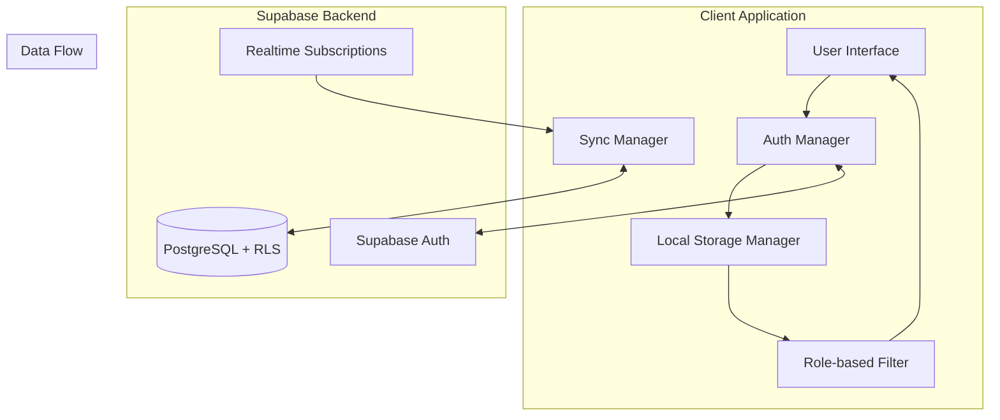
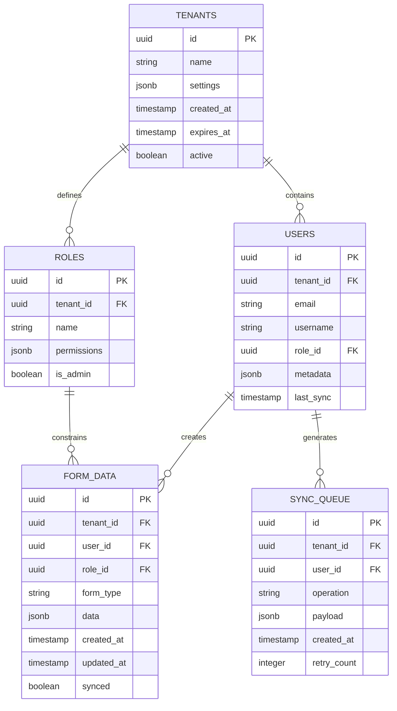

# Design Document

## Overview

creo qEste diseño implementa una arquitectura multi-tenant offline-first que garantiza escalabilidad, seguridad y funcionamiento robusto en entornos con conectividad limitada. El sistema utiliza Supabase con Row Level Security (RLS), almacenamiento local con IndexedDB, y un sistema de sincronización inteligente que maneja conflictos y optimiza el uso de ancho de banda.

## Architecture

### High-Level Architecture



### Multi-Tenant Data Architecture



## Components and Interfaces

### 1. Tenant Management Service

```typescript
interface TenantService {
  createTenant(config: TenantConfig): Promise<Tenant>
  createTenantUsers(tenantId: string, users: UserConfig[]): Promise<User[]>
  updateTenantSettings(tenantId: string, settings: TenantSettings): Promise<void>
  deactivateTenant(tenantId: string): Promise<void>
  getTenantStatus(tenantId: string): Promise<TenantStatus>
}

interface TenantConfig {
  name: string
  licenseCount: number
  expirationDate: Date
  settings: TenantSettings
}

interface TenantSettings {
  dataRetentionDays: number
  maxOfflineStorage: number
  syncFrequency: number
  conflictResolution: 'server-wins' | 'client-wins' | 'merge'
}
```

### 2. Authentication Manager

```typescript
interface AuthManager {
  authenticate(username: string, password: string): Promise<AuthResult>
  getCurrentUser(): User | null
  getCurrentTenant(): Tenant | null
  logout(): Promise<void>
  refreshSession(): Promise<void>
}

interface AuthResult {
  user: User
  tenant: Tenant
  role: Role
  permissions: Permission[]
  sessionToken: string
}
```

### 3. Local Storage Manager

```typescript
interface LocalStorageManager {
  initializeUserSpace(userId: string, tenantId: string): Promise<void>
  storeData(formType: string, data: any): Promise<string>
  getData(formType: string, filters?: DataFilter): Promise<any[]>
  queueForSync(operation: SyncOperation): Promise<void>
  clearUserData(userId: string): Promise<void>
}

interface DataFilter {
  tenantId?: string
  userId?: string
  roleId?: string
  dateRange?: DateRange
  customFilters?: Record<string, any>
}
```

### 4. Sync Manager

```typescript
interface SyncManager {
  startSync(): Promise<SyncResult>
  stopSync(): void
  getQueueStatus(): SyncQueueStatus
  resolveConflict(conflict: DataConflict): Promise<void>
  optimizeStorage(): Promise<void>
}

interface SyncResult {
  uploaded: number
  downloaded: number
  conflicts: DataConflict[]
  errors: SyncError[]
}
```

### 5. Role-based Access Control

```typescript
interface RoleManager {
  checkPermission(action: string, resource: string): boolean
  filterDataByRole(data: any[], role: Role): any[]
  filterDataByScope(data: any[], userId: string, scope: RoleScope): any[]
  getAccessibleForms(): string[]
  canAccessData(dataId: string, userId: string): boolean
}

interface Permission {
  resource: string
  actions: string[]
  conditions?: Record<string, any>
}

interface RoleScope {
  type: 'own' | 'tenant'
  description: string
}

interface GenericRole {
  name: 'admin' | 'manager' | 'user' | 'viewer'
  scope: RoleScope
  permissions: Permission[]
  description: string
}
```

## Generic Role System

### Role Definitions

The system implements four generic roles applicable to any business domain:

```typescript
const GENERIC_ROLES = {
  admin: {
    name: 'admin',
    scope: 'tenant',
    permissions: ['create', 'read', 'update', 'delete', 'manage_users', 'manage_config'],
    description: 'Full access to all tenant data and configuration',
    isAdmin: true,
    canCreateUsers: true
  },
  manager: {
    name: 'manager', 
    scope: 'tenant',
    permissions: ['create', 'read', 'update', 'delete', 'manage_users'],
    description: 'Full access to all tenant data, can manage users but not configuration',
    isAdmin: false,
    canCreateUsers: true
  },
  user: {
    name: 'user',
    scope: 'own', 
    permissions: ['create', 'read', 'update'],
    description: 'Can only access and modify their own created data',
    isAdmin: false,
    canCreateUsers: false
  },
  viewer: {
    name: 'viewer',
    scope: 'own',
    permissions: ['read'],
    description: 'Read-only access to their own data or assigned data',
    isAdmin: false,
    canCreateUsers: false
  }
}
```

### Scope-Based Data Access

- **"tenant" scope**: User can access all data within their tenant
- **"own" scope**: User can only access data they created (where created_by = user_id)

### Role Permission Matrix

| Role    | Scope  | Create | Read | Update | Delete | Manage Users | Manage Config |
|---------|--------|--------|------|--------|--------|--------------|---------------|
| admin   | tenant | ✓      | ✓    | ✓      | ✓      | ✓            | ✓             |
| manager | tenant | ✓      | ✓    | ✓      | ✓      | ✓            | ✗             |
| user    | own    | ✓      | ✓    | ✓      | ✗      | ✗            | ✗             |
| viewer  | own    | ✗      | ✓    | ✗      | ✗      | ✗            | ✗             |

## Data Models

### Core Data Models

```typescript
interface Tenant {
  id: string
  name: string
  settings: TenantSettings
  createdAt: Date
  expiresAt: Date
  active: boolean
  licenseCount: number
  usedLicenses: number
}

interface User {
  id: string
  tenantId: string
  email: string
  username: string
  roleId: string
  metadata: Record<string, any>
  lastSync: Date
  isActive: boolean
}

interface Role {
  id: string
  tenantId: string
  name: 'admin' | 'manager' | 'user' | 'viewer'
  scope: 'own' | 'tenant'
  permissions: Permission[]
  isAdmin: boolean
  canCreateUsers: boolean
  description: string
}

interface FormData {
  id: string
  tenantId: string
  userId: string
  roleId: string
  formType: string
  data: Record<string, any>
  createdAt: Date
  updatedAt: Date
  synced: boolean
  version: number
}
```

### Sync Models

```typescript
interface SyncOperation {
  id: string
  tenantId: string
  userId: string
  operation: 'CREATE' | 'UPDATE' | 'DELETE'
  tableName: string
  recordId: string
  payload: any
  timestamp: Date
  retryCount: number
}

interface DataConflict {
  recordId: string
  localVersion: any
  serverVersion: any
  conflictType: 'UPDATE_UPDATE' | 'UPDATE_DELETE' | 'DELETE_UPDATE'
  resolutionStrategy: string
}
```

## Correctness Properties

*A property is a characteristic or behavior that should hold true across all valid executions of a system-essentially, a formal statement about what the system should do. Properties serve as the bridge between human-readable specifications and machine-verifiable correctness guarantees.*

### Tenant Management Properties

**Property 1: Tenant isolation during creation**
*For any* tenant creation operation, the system should create unique credentials and isolated data space without affecting existing tenants
**Validates: Requirements 1.1**

**Property 2: User-tenant association consistency**
*For any* user creation within a tenant, the user should be properly associated with that tenant and assigned role, with no cross-tenant contamination
**Validates: Requirements 1.2**

**Property 3: Tenant configuration isolation**
*For any* tenant configuration update, only the target tenant's settings should change while all other tenants remain unaffected
**Validates: Requirements 1.3**

**Property 4: Tenant deactivation access control**
*For any* deactivated tenant, all associated users should be denied access while tenant data remains intact and recoverable
**Validates: Requirements 1.4**

**Property 5: License expiration enforcement**
*For any* tenant with expired license, access should be automatically restricted while maintaining data availability for reactivation
**Validates: Requirements 1.5**

### Authentication Properties

**Property 6: Credential-based tenant detection**
*For any* valid user credentials, authentication should automatically determine and establish correct tenant association without manual selection
**Validates: Requirements 2.1**

**Property 7: Session context establishment**
*For any* successful authentication, the system should establish user session with complete tenant context and role permissions
**Validates: Requirements 2.2**

**Property 8: Credential security**
*For any* invalid credentials, authentication should fail without revealing any tenant information or system details
**Validates: Requirements 2.3**

**Property 9: Offline data preparation**
*For any* established user session, the system should load appropriate user-specific data and permissions for offline operation
**Validates: Requirements 2.4**

**Property 10: Multi-user device isolation**
*For any* device with multiple user logins, each user should have completely separate offline data spaces with no cross-contamination
**Validates: Requirements 2.5**

### Data Isolation Properties

**Property 11: Comprehensive tenant data isolation**
*For any* data operation (query, display, access), the system should automatically filter by current user's tenant and role, preventing cross-tenant data access
**Validates: Requirements 3.1, 3.3, 8.2**

**Property 12: Automatic data context tagging**
*For any* data storage operation, the system should automatically include tenant_id, user_id, role_id, and timestamp without manual intervention
**Validates: Requirements 3.2, 8.1**

**Property 13: Missing context rejection**
*For any* operation attempted without proper tenant context, the system should reject the operation and log a security event
**Validates: Requirements 3.4**

**Property 14: Sync tenant isolation**
*For any* data synchronization operation, tenant isolation should be maintained during both upload and download phases
**Validates: Requirements 3.5**

### Offline Operation Properties

**Property 15: Offline functionality continuity**
*For any* network disconnection, the system should continue operating normally using locally stored data
**Validates: Requirements 4.1**

**Property 16: Offline operation queuing and sync**
*For any* data operations performed offline, changes should be queued and automatically synchronized when connection is restored
**Validates: Requirements 4.2, 4.3**

**Property 17: Conflict resolution consistency**
*For any* synchronization conflicts, the system should resolve them using predefined tenant-specific rules consistently
**Validates: Requirements 4.4, 7.4**

**Property 18: Storage capacity management**
*For any* offline storage approaching capacity, the system should efficiently manage space while preserving critical data
**Validates: Requirements 4.5**

### Role-Based Access Properties

**Property 19: Own-scope data isolation**
*For any* user with "own" scope role, data access should return only records where created_by equals the user's ID
**Validates: Requirements 5.1**

**Property 20: Tenant-scope data access**
*For any* user with "tenant" scope role, data access should return all records within the user's tenant regardless of creator
**Validates: Requirements 5.2**

**Property 21: Authorization enforcement with audit**
*For any* unauthorized action attempt, the system should prevent the action and maintain complete audit trail
**Validates: Requirements 5.3, 8.5**

**Property 22: Permission update propagation**
*For any* role permission changes, user access should be updated immediately upon next synchronization
**Validates: Requirements 5.4**

**Property 23: Data creator tagging**
*For any* data creation, the system should automatically tag data with creator's user_id and role for future access control
**Validates: Requirements 5.5**

### Generic Role System Properties

**Property 32: Generic role type enforcement**
*For any* role creation attempt, the system should accept only admin, manager, user, and viewer role types and reject any other role names
**Validates: Requirements 9.1**

**Property 33: Role scope assignment rules**
*For any* role assignment, the system should enforce that user and viewer roles have "own" scope while admin and manager roles have "tenant" scope
**Validates: Requirements 9.2**

**Property 34: Own-scope user data isolation**
*For any* user with "own" scope who creates data, only that specific user should be able to access the created data within the tenant
**Validates: Requirements 9.3**

**Property 35: Tenant-scope cross-user access**
*For any* user with "tenant" scope, they should have access to all data within their tenant regardless of which user created it
**Validates: Requirements 9.4**

**Property 36: Insufficient permission denial with logging**
*For any* operation attempted with insufficient role permissions, the system should deny access and create a security log entry
**Validates: Requirements 9.5**

### System Reliability Properties

**Property 24: Query optimization for tenant filtering**
*For any* database operation, the system should use optimized queries with proper indexing for efficient tenant-based filtering
**Validates: Requirements 6.2**

**Property 25: Graceful degradation**
*For any* system component failure, the system should continue operating with graceful degradation rather than complete failure
**Validates: Requirements 6.3**

**Property 26: Data corruption isolation**
*For any* detected data corruption, the system should isolate affected tenant data while maintaining overall system availability
**Validates: Requirements 6.4**

### Synchronization Properties

**Property 27: Connection detection and sync initiation**
*For any* device coming online, the Sync_Manager should detect connection and automatically initiate bidirectional synchronization
**Validates: Requirements 7.1**

**Property 28: Incremental sync optimization**
*For any* synchronization operation, the system should use incremental sync and bandwidth optimization techniques
**Validates: Requirements 7.2, 7.5**

**Property 29: Sync failure retry logic**
*For any* failed sync operation, the system should retry with exponential backoff while maintaining operation queue integrity
**Validates: Requirements 7.3**

### Data Relationship Properties

**Property 30: Cross-tenant relationship validation**
*For any* form data with relationships, the system should validate that all related data belongs to the same tenant
**Validates: Requirements 8.3**

**Property 31: Data lineage preservation**
*For any* historical data access, the system should maintain complete data lineage with original creator information
**Validates: Requirements 8.4**

## Error Handling

### Network Error Handling

```typescript
interface NetworkErrorHandler {
  handleConnectionLoss(): void
  handleSyncFailure(error: SyncError): Promise<void>
  handleTimeoutError(operation: string): Promise<void>
  retryWithBackoff(operation: () => Promise<any>, maxRetries: number): Promise<any>
}
```

**Error Scenarios:**
- **Connection Loss**: Gracefully switch to offline mode, queue operations
- **Sync Conflicts**: Apply tenant-specific resolution rules, log conflicts
- **Authentication Failures**: Clear session, redirect to login, preserve offline data
- **Storage Quota Exceeded**: Implement intelligent data pruning, prioritize critical data
- **Data Corruption**: Isolate corrupted data, attempt recovery, maintain system operation

### Security Error Handling

```typescript
interface SecurityErrorHandler {
  handleUnauthorizedAccess(userId: string, resource: string): void
  handleTenantViolation(operation: string, tenantId: string): void
  handleDataIntegrityViolation(dataId: string): void
  logSecurityEvent(event: SecurityEvent): void
}
```

**Security Scenarios:**
- **Cross-tenant Access Attempts**: Block operation, log security event, audit trail
- **Role Permission Violations**: Deny access, log attempt, notify administrators
- **Data Tampering Detection**: Isolate affected data, trigger security protocols
- **Session Hijacking**: Invalidate sessions, force re-authentication

### Data Consistency Error Handling

```typescript
interface ConsistencyErrorHandler {
  handleSyncConflict(conflict: DataConflict): Promise<ConflictResolution>
  handleOrphanedData(dataId: string): Promise<void>
  handleVersionMismatch(localVersion: number, serverVersion: number): Promise<void>
  validateDataIntegrity(data: any): Promise<ValidationResult>
}
```

## Testing Strategy

### Dual Testing Approach

This system requires both unit testing and property-based testing to ensure comprehensive coverage:

- **Unit tests** verify specific examples, edge cases, and error conditions
- **Property tests** verify universal properties that should hold across all inputs
- Together they provide comprehensive coverage: unit tests catch concrete bugs, property tests verify general correctness

### Property-Based Testing Requirements

- **Testing Library**: Use `fast-check` for JavaScript/TypeScript property-based testing
- **Test Configuration**: Each property-based test must run a minimum of 100 iterations
- **Test Tagging**: Each property-based test must include a comment with format: `**Feature: multi-tenant-offline-system, Property {number}: {property_text}**`
- **Property Implementation**: Each correctness property must be implemented by a single property-based test
- **Coverage**: Property tests should focus on tenant isolation, data consistency, and sync behavior

### Unit Testing Requirements

**Core Areas for Unit Testing:**
- Authentication flows with specific credential combinations
- Role permission calculations with known user/role combinations
- Data filtering with specific tenant/role scenarios
- Sync conflict resolution with predetermined conflict types
- Error handling with specific error conditions

**Testing Patterns:**
- **Tenant Isolation**: Verify operations with multiple tenants don't cross-contaminate
- **Role Enforcement**: Test specific role combinations and permission scenarios
- **Offline Behavior**: Test specific offline/online transition scenarios
- **Data Integrity**: Test specific data corruption and recovery scenarios

### Integration Testing

**Key Integration Points:**
- Supabase RLS policy enforcement
- IndexedDB storage operations
- Network connectivity detection
- Real-time subscription handling
- Cross-component data flow

### Performance Testing

**Critical Performance Areas:**
- Query performance with large tenant datasets
- Sync performance with limited bandwidth
- Storage efficiency with large offline datasets
- Memory usage during extended offline periods

## Implementation Notes

### Database Schema Considerations

**Row Level Security (RLS) Policies:**
```sql
-- Tenant isolation policy (base level)
CREATE POLICY tenant_isolation ON form_data
  FOR ALL TO authenticated
  USING (tenant_id = auth.jwt() ->> 'tenant_id');

-- Scope-based access policy for "own" scope users
CREATE POLICY own_scope_access ON form_data
  FOR ALL TO authenticated
  USING (
    tenant_id = auth.jwt() ->> 'tenant_id' AND
    (
      -- Users with "tenant" scope see all tenant data
      (auth.jwt() ->> 'role_scope') = 'tenant' OR
      -- Users with "own" scope see only their own data
      ((auth.jwt() ->> 'role_scope') = 'own' AND created_by = auth.uid())
    )
  );

-- Permission-based action policy
CREATE POLICY permission_based_actions ON form_data
  FOR ALL TO authenticated
  USING (
    tenant_id = auth.jwt() ->> 'tenant_id' AND
    check_role_permission(auth.jwt() ->> 'role_name', TG_OP, 'form_data')
  );
```

**Indexing Strategy:**
```sql
-- Composite indexes for tenant and user-based queries
CREATE INDEX idx_form_data_tenant_user ON form_data(tenant_id, created_by, created_at);
CREATE INDEX idx_form_data_tenant_type ON form_data(tenant_id, form_type, created_at);
CREATE INDEX idx_form_data_user_type ON form_data(created_by, form_type, created_at);
CREATE INDEX idx_sync_queue_tenant_user ON sync_queue(tenant_id, user_id, created_at);
CREATE INDEX idx_users_tenant_role ON users(tenant_id, rol, activo);
```

### Offline Storage Architecture

**IndexedDB Structure:**
- **User Stores**: Separate object stores per user to ensure isolation
- **Sync Queue**: Persistent queue for offline operations
- **Metadata Store**: User permissions, role data, tenant configuration
- **Form Data Stores**: Organized by form type for efficient querying

### Sync Optimization Strategies

**Bandwidth Optimization:**
- Delta sync: Only transmit changed fields
- Compression: Use gzip compression for sync payloads
- Prioritization: Critical data syncs first
- Batching: Group operations to reduce round trips

**Conflict Resolution:**
- **Server Wins**: Default for configuration data
- **Client Wins**: For user-generated content with timestamps
- **Merge**: For non-conflicting field updates
- **Manual**: For critical business data conflicts

### Security Implementation

**Authentication Flow:**
1. Username/password authentication via Supabase Auth
2. JWT token includes tenant_id, user_id, role_id
3. Client stores encrypted session data locally
4. Automatic token refresh with tenant validation

**Data Encryption:**
- Sensitive offline data encrypted using Web Crypto API
- User-specific encryption keys derived from session
- Automatic key rotation on session refresh

This design provides a robust, scalable foundation for a multi-tenant offline-first application that can handle the challenges of limited connectivity while maintaining strict data isolation and security.